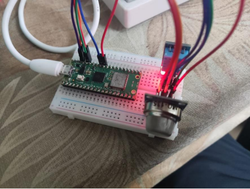

# Air-Quality-Monitoring-System

This project is an IoT-based solution designed to monitor gas concentration and temperature levels in real time. The system is ideal for applications in kitchens, laboratories, or industrial settings to ensure safety and maintain operational efficiency.

## Features
- **Real-Time Monitoring:** Tracks gas concentration and ambient temperature using sensors.
- **Threshold-Based Alerts:** Sends instant notifications to users via the Blynk app when values exceed safe limits.
- **User-Friendly Interface:** Data visualization and notifications are seamlessly integrated with the Blynk app.
- **Cost-Effective Design:** Built using readily available and affordable components.

---

## Project Structure
```
Gas-and-Temperature-Monitoring/
|
├── main.py                 # Python script for sensor integration and data transmission
├── README.md               # Project documentation
├── Images/                 # Folder containing project-related images
│   ├── Block diagram.png
│   ├── Circuit_Diagram.png
│   ├── Desktop_output.png
|   └── notfication.png
```

---

## Components Used

### Hardware
- **ESP32** microcontroller
- MQ-135 Air Quality Sensor
- DHT11/DHT22 Temperature and Humidity Sensor
- Jumper wires
- Breadboard

### Software
- Python with the `Thonny` IDE
- Blynk IoT Platform
- Google Firebase

---

## Setup Instructions

### Hardware Setup
1. Connect the MQ-135 and DHT11 sensors to the ESP32 microcontroller as per the schematic diagram.
2. Power the system using a 5V power supply.

### Software Setup
1. Install the `Blynk` app on your smartphone and set up a project.
2. Use the provided `main.py` script to configure the ESP32 for:
   - Reading sensor data
   - Sending data to the Blynk server
3. Update the `ssid`, `password`, and `BLYNK_AUTH_TOKEN` in the script.
4. Setup a Google Firebase database and and add the url to the `main.py`.

### Running the System
1. Upload the `main.py` script to the ESP32 using Thonny IDE.
2. Monitor the sensor readings in real time via the Blynk app.
3. Receive alerts when gas or temperature levels exceed the thresholds.
4. Every value recorded gets stored in the Firebase database.

---

## Images
### Block Diagram


### Circuti Diagram


### Desktop Output


### Mobile Notification


---

## Results and Discussion
The IoT-based monitoring system successfully tracks gas concentration and temperature in real time. Testing has shown accurate readings and reliable alerts through the Blynk app and registered gmail, making this system a practical solution for ensuring environmental safety.
And every data recorded is stored in google firebase for future usage and analysis.

---

## Future Enhancements
- **Enhanced Sensors:** Incorporate more precise gas sensors for detecting specific harmful gases.
- **Additional Features:** Add alarms, LCD displays, or ventilation controls.
- **Scalability:** Expand the system for larger environments.

---

## License
This project is open-source and available under the MIT License.
